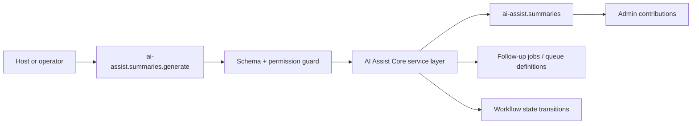
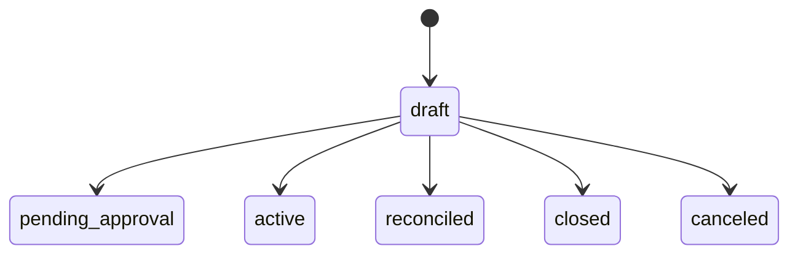

# AI Assist Core Developer Guide

Guardrailed AI summaries, triage suggestions, anomaly detection, and operator-assist workflows for business teams.

**Maturity Tier:** `Hardened`

## Purpose And Architecture Role

Provides bounded AI summaries, triage suggestions, and anomaly-review state for business teams without making AI the source of truth.

### This plugin is the right fit when

- You need **assist summaries**, **triage suggestions**, **anomaly review** as a governed domain boundary.
- You want to integrate through declared actions, resources, jobs, workflows, and UI surfaces instead of implicit side effects.
- You need the host application to keep plugin boundaries honest through manifest capabilities, permissions, and verification lanes.

### This plugin is intentionally not

- Not an everything-and-the-kitchen-sink provider abstraction layer.
- Not a substitute for explicit approval, budgeting, and audit governance in the surrounding platform.

## Repo Map

| Path | Purpose |
| --- | --- |
| `package.json` | Root extracted-repo manifest, workspace wiring, and repo-level script entrypoints. |
| `framework/builtin-plugins/ai-assist-core` | Nested publishable plugin package. |
| `framework/builtin-plugins/ai-assist-core/src` | Runtime source, actions, resources, services, and UI exports. |
| `framework/builtin-plugins/ai-assist-core/tests` | Unit, contract, integration, and migration coverage where present. |
| `framework/builtin-plugins/ai-assist-core/docs` | Internal domain-doc source set kept in sync with this guide. |
| `framework/builtin-plugins/ai-assist-core/db/schema.ts` | Database schema contract when durable state is owned. |
| `framework/builtin-plugins/ai-assist-core/src/postgres.ts` | SQL migration and rollback helpers when exported. |

## Manifest Contract

| Field | Value |
| --- | --- |
| Package Name | `@plugins/ai-assist-core` |
| Manifest ID | `ai-assist-core` |
| Display Name | AI Assist Core |
| Domain Group | AI Systems |
| Default Category | AI & Automation / Operating Models |
| Version | `0.1.0` |
| Kind | `plugin` |
| Trust Tier | `first-party` |
| Review Tier | `R1` |
| Isolation Profile | `same-process-trusted` |
| Framework Compatibility | ^0.1.0 |
| Runtime Compatibility | bun>=1.3.12 |
| Database Compatibility | postgres, sqlite |

## Dependency Graph And Capability Requests

| Field | Value |
| --- | --- |
| Depends On | `auth-core`, `org-tenant-core`, `role-policy-core`, `audit-core`, `workflow-core`, `ai-core`, `ai-rag`, `crm-core`, `support-service-core`, `sales-core`, `traceability-core` |
| Recommended Plugins | None |
| Capability Enhancing | None |
| Integration Only | None |
| Suggested Packs | None |
| Standalone Supported | Yes |
| Requested Capabilities | `ui.register.admin`, `api.rest.mount`, `data.write.ai-assist`, `events.publish.ai-assist` |
| Provides Capabilities | `ai-assist.summaries`, `ai-assist.triage`, `ai-assist.anomalies` |
| Owns Data | `ai-assist.summaries`, `ai-assist.triage`, `ai-assist.anomalies`, `ai-assist.feedback` |

### Dependency interpretation

- Direct plugin dependencies describe package-level coupling that must already be present in the host graph.
- Requested capabilities tell the host what platform services or sibling plugins this package expects to find.
- Provided capabilities and owned data tell integrators what this package is authoritative for.

## Public Integration Surfaces

| Type | ID / Symbol | Access / Mode | Notes |
| --- | --- | --- | --- |
| Action | `ai-assist.summaries.generate` | Permission: `ai-assist.summaries.write` | Generate Summary<br>Idempotent<br>Audited |
| Action | `ai-assist.triage.route` | Permission: `ai-assist.triage.write` | Route Triage Suggestion<br>Non-idempotent<br>Audited |
| Action | `ai-assist.anomalies.review` | Permission: `ai-assist.anomalies.write` | Review AI Anomaly<br>Non-idempotent<br>Audited |
| Action | `ai-assist.summaries.hold` | Permission: `ai-assist.summaries.write` | Place Record On Hold<br>Non-idempotent<br>Audited |
| Action | `ai-assist.summaries.release` | Permission: `ai-assist.summaries.write` | Release Record Hold<br>Non-idempotent<br>Audited |
| Action | `ai-assist.summaries.amend` | Permission: `ai-assist.summaries.write` | Amend Record<br>Non-idempotent<br>Audited |
| Action | `ai-assist.summaries.reverse` | Permission: `ai-assist.summaries.write` | Reverse Record<br>Non-idempotent<br>Audited |
| Resource | `ai-assist.summaries` | Portal disabled | Generated summaries and operator-reviewed assist artifacts.<br>Purpose: Provide bounded AI assistance without making AI the source of business truth.<br>Admin auto-CRUD enabled<br>Fields: `title`, `recordState`, `approvalState`, `postingState`, `fulfillmentState`, `updatedAt` |
| Resource | `ai-assist.triage` | Portal disabled | AI-generated triage and routing suggestions for business workflows.<br>Purpose: Surface assistive routing suggestions that operators can review and accept.<br>Admin auto-CRUD enabled<br>Fields: `label`, `status`, `requestedAction`, `updatedAt` |
| Resource | `ai-assist.anomalies` | Portal disabled | Anomaly detection records and operator-review state.<br>Purpose: Track suspicious operational patterns and approval-gated follow-up explicitly.<br>Admin auto-CRUD enabled<br>Fields: `severity`, `status`, `reasonCode`, `updatedAt` |

### Job Catalog

| Job | Queue | Retry | Timeout |
| --- | --- | --- | --- |
| `ai-assist.projections.refresh` | `ai-assist-projections` | Retry policy not declared | No timeout declared |
| `ai-assist.reconciliation.run` | `ai-assist-reconciliation` | Retry policy not declared | No timeout declared |


### Workflow Catalog

| Workflow | Actors | States | Purpose |
| --- | --- | --- | --- |
| `ai-assist-lifecycle` | `operator`, `reviewer`, `approver` | `draft`, `pending_approval`, `active`, `reconciled`, `closed`, `canceled` | Keep AI-generated assistance reviewable, reversible, and explicit before downstream action occurs. |


### UI Surface Summary

| Surface | Present | Notes |
| --- | --- | --- |
| UI Surface | Yes | A bounded UI surface export is present. |
| Admin Contributions | Yes | Additional admin workspace contributions are exported. |
| Zone/Canvas Extension | No | No dedicated zone extension export. |

## Hooks, Events, And Orchestration

This plugin should be integrated through **explicit commands/actions, resources, jobs, workflows, and the surrounding Gutu event runtime**. It must **not** be documented as a generic WordPress-style hook system unless such a hook API is explicitly exported.

- No standalone plugin-owned lifecycle event feed is exported today.
- Job surface: `ai-assist.projections.refresh`, `ai-assist.reconciliation.run`.
- Workflow surface: `ai-assist-lifecycle`.
- Recommended composition pattern: invoke actions, read resources, then let the surrounding Gutu command/event/job runtime handle downstream automation.

## Storage, Schema, And Migration Notes

- Database compatibility: `postgres`, `sqlite`
- Schema file: `framework/builtin-plugins/ai-assist-core/db/schema.ts`
- SQL helper file: `framework/builtin-plugins/ai-assist-core/src/postgres.ts`
- Migration lane present: Yes

The plugin ships explicit SQL helper exports. Use those helpers as the truth source for database migration or rollback expectations.

## Failure Modes And Recovery

- Action inputs can fail schema validation or permission evaluation before any durable mutation happens.
- If downstream automation is needed, the host must add it explicitly instead of assuming this plugin emits jobs.
- There is no separate lifecycle-event feed to rely on today; do not build one implicitly from internal details.
- Schema regressions are expected to show up in the migration lane and should block shipment.

## Mermaid Flows

### Primary Lifecycle



### Workflow State Machine




## Integration Recipes

### 1. Host wiring

```ts
import { manifest, generateSummaryAction, BusinessPrimaryResource, jobDefinitions, workflowDefinitions, adminContributions, uiSurface } from "@plugins/ai-assist-core";

export const pluginSurface = {
  manifest,
  generateSummaryAction,
  BusinessPrimaryResource,
  jobDefinitions,
  workflowDefinitions,
  adminContributions,
  uiSurface
};
```

Use this pattern when your host needs to register the plugin’s declared exports without reaching into internal file paths.

### 2. Action-first orchestration

```ts
import { manifest, generateSummaryAction } from "@plugins/ai-assist-core";

console.log("plugin", manifest.id);
console.log("action", generateSummaryAction.id);
```

- Prefer action IDs as the stable integration boundary.
- Respect the declared permission, idempotency, and audit metadata instead of bypassing the service layer.
- Treat resource IDs as the read-model boundary for downstream consumers.

### 3. Cross-plugin composition

- Register the workflow definitions with the host runtime instead of re-encoding state transitions outside the plugin.
- Drive follow-up automation from explicit workflow transitions and resource reads.
- Pair workflow decisions with notifications or jobs in the outer orchestration layer when humans must be kept in the loop.

## Test Matrix

| Lane | Present | Evidence |
| --- | --- | --- |
| Build | Yes | `bun run build` |
| Typecheck | Yes | `bun run typecheck` |
| Lint | Yes | `bun run lint` |
| Test | Yes | `bun run test` |
| Unit | Yes | 1 file(s) |
| Contracts | Yes | 1 file(s) |
| Integration | Yes | 1 file(s) |
| Migrations | Yes | 2 file(s) |

### Verification commands

- `bun run build`
- `bun run typecheck`
- `bun run lint`
- `bun run test`
- `bun run test:contracts`
- `bun run test:unit`
- `bun run test:integration`
- `bun run test:migrations`
- `bun run docs:check`

## Current Truth And Recommended Next

### Current truth

- Exports 7 governed actions: `ai-assist.summaries.generate`, `ai-assist.triage.route`, `ai-assist.anomalies.review`, `ai-assist.summaries.hold`, `ai-assist.summaries.release`, `ai-assist.summaries.amend`, `ai-assist.summaries.reverse`.
- Owns 3 resource contracts: `ai-assist.summaries`, `ai-assist.triage`, `ai-assist.anomalies`.
- Publishes 2 job definitions with explicit queue and retry policy metadata.
- Publishes 1 workflow definition with state-machine descriptions and mandatory steps.
- Adds richer admin workspace contributions on top of the base UI surface.
- Ships explicit SQL migration or rollback helpers alongside the domain model.
- Documents 4 owned entity surface(s): `Summary Log`, `Triage Suggestion`, `Anomaly Review`, `Feedback Record`.
- Carries 3 report surface(s) and 3 exception queue(s) for operator parity and reconciliation visibility.
- Tracks ERPNext reference parity against module(s): `CRM`, `Support`, `Projects`.
- Operational scenario matrix includes `summary-generation`, `triage-routing`, `anomaly-review-with-human-approval`.
- Governs 3 settings or policy surface(s) for operator control and rollout safety.

### Current gaps

- No extra gaps were discovered beyond the plugin’s declared boundaries.

### Recommended next

- Deepen review, feedback, and rollback flows as more operators use AI assistance in production workflows.
- Clarify domain-specific guardrails and downstream action policies before automated assist paths broaden.
- Add deeper provider, persistence, or evaluation integrations only where the shipped control-plane contracts already prove stable.
- Expand operator diagnostics and release gating where the current lifecycle already exposes strong evidence paths.
- Convert more ERP parity references into first-class runtime handlers where needed, starting from `Lead`, `Opportunity`, `Issue`.

### Later / optional

- More connector breadth, richer evaluation libraries, and domain-specific copilots after the baseline contracts settle.
